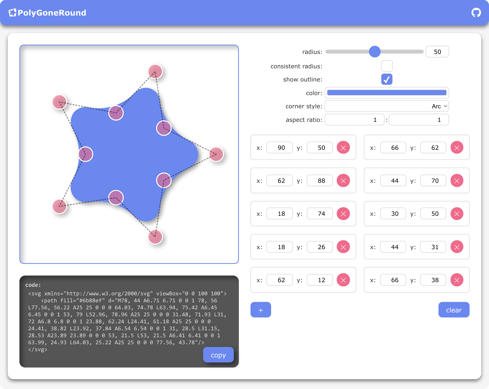

# PolyGoneRound

**»[make your polygons more well-rounded](https://99-knots.github.io/PolyGoneRound/)«**

PolyGoneRound is a lightweight web app designed to create and fully customize polygons with rounded corners directly in the browser. Whether you are creating icons, logos, UI elements or just some fun background graphics, PolyGoneRound will make your shapes more visually appealing and less likely to poke someone's eye out. The dynamically generated SVG code allows for easy export and use in your projects.

## Features
- **Add Corners:** Click on the canvas or the `+`-button to add a new corner point to your polygon.
- **Edit Corners:** Drag a point to reposition it or manually enter coordinates for precise control.
- **Reset:** Clear the canvas of all previously placed points.
- **Adjust Radius:** Change the maximum radius for the corners' curvature either with the slider or through the input field.
- **Toggle Radius Consistency:** Choose wether all corners should follow the smallest allowed radius or allow for varied roundness.
- **Corner Style:** Switch between circle arcs or bezier curves as a basis for the corner rounding.
- **Color Customization:** Change the color of the drawn polygon to fit different designs.
- **Canvas Sizing:** Adjust the aspect ratio of the canvas for different design needs.
- **SVG Generation:** Copy the instantly provided code to take your shape anywhere that welcomes SVGs.
